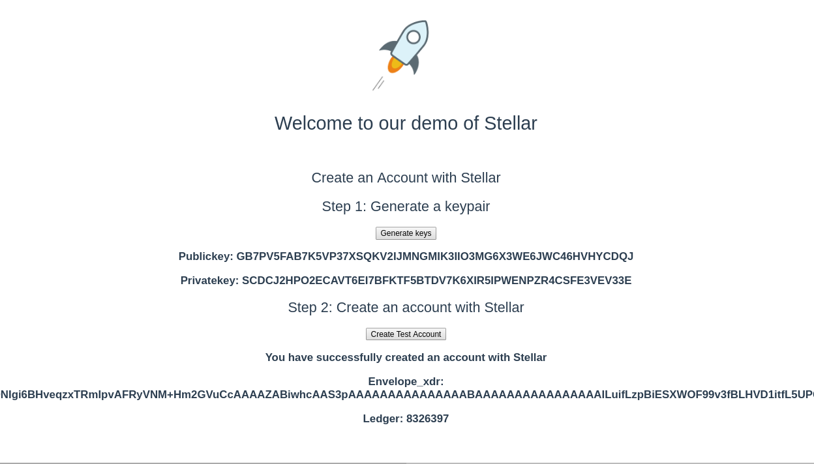
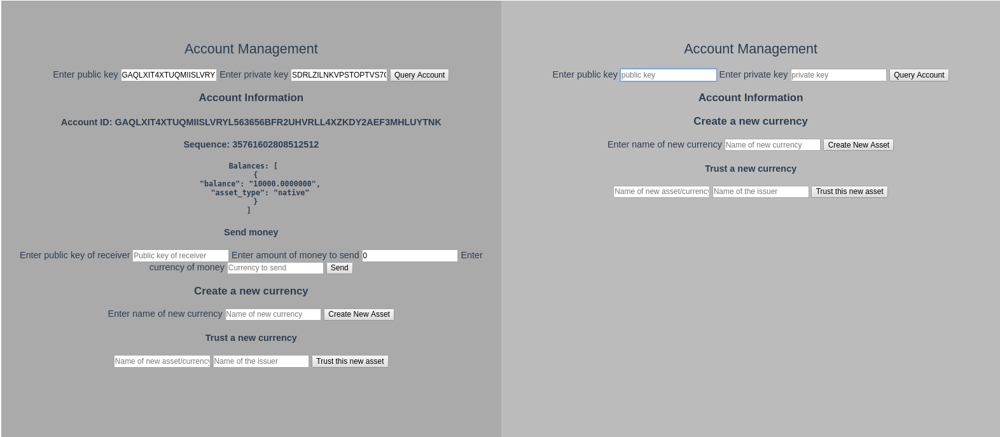

# Coursework for CSC 466: Peer to Peer OverlayNetwork
 
## Project: Effects of Blockchain on Financial System

## What it contains:

This repository contains a demo of some critical feature of the Stellar network, including:

1. How to enerate a keypair
2. How to create an account with Stellar
3. How to send money to a different account
4. How to create a new currency/asset
5. How to trusta new currency
6. How to send money with the new currency
7. How to query account and see information such as public key or balances

### Example of creating a keypair

### Example of querying account information

## How to run:

### Install requirements:
`npm install .`
or run
`make`

### To run the program:
run `make`

## Build with:
* [Vue](https://vuejs.org/)
* [NodeJS](https://nodejs.org/en/)
* [Stellar Core](https://www.stellar.org/developers/)
